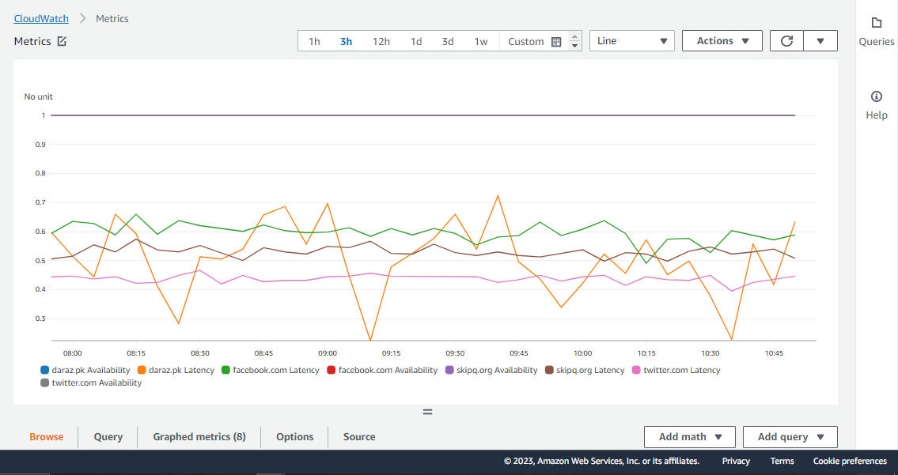
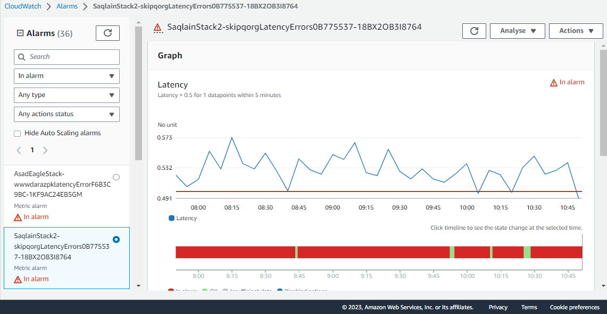
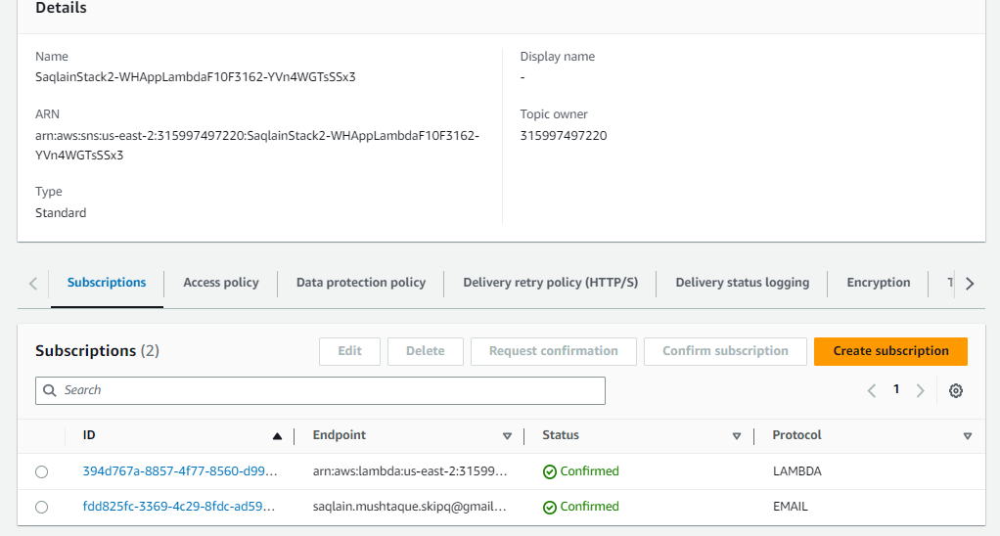
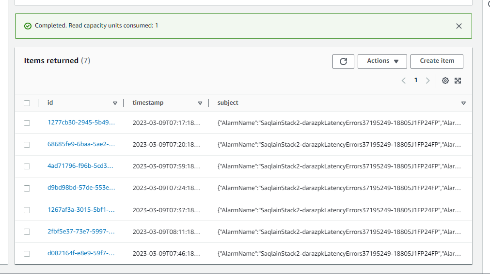
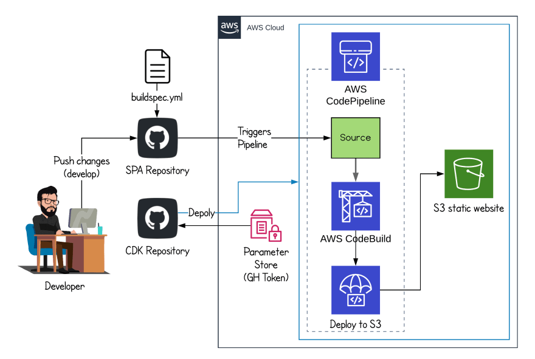

# Welcome to your CDK Python project!

## **Topics**:
* ### [Prerequisite for Web Health Lambda](#prerequisite-of-web-health-lambda) 
* ### [Use commands](#useful-commands).
* ### [Web Health Project](#website-health-application-for-4-urls).
* ### [Project Design](#project-design-1)
* ### [Creating Lambda](#creating-lambda-1).
* ### [Convert lambda into cronjob](#converting-my-lambda-into-cronjob).
* ### [Publish Lambda to cloudwatch metrics](#publish-metrics-to-cloudwatch).
* ### [Set Trigger Alarm on Metrics](#add-alarm-to-the-cloud-watch).
* ### [Set SNS On Alarm](#set-sns-on-alarm-1).
* ### [Create DynamoDB Table](#creating-dynamodb-table).
* ### [Introduction of Pipeline](#introduction-of-cicd-pipeline)
* ### [Create and Connect Pipeline stages](#create-and-connect-pipeline-stage)
* ### [Create Stage File](#create-a-stage-file)
* ### [Create Pipeline](#creating-pipeline)
* ### [Add Stages](#add-stages-1)


## **Prerequisite of Web Health Lambda:**

The `cdk.json` file tells the CDK Toolkit how I execute my app.

The initialization process creates a virtualenv within this project, stored under the `.venv`
directory.  To create the virtualenv it assumes that there is a `python3`
(or `python` for Windows) executable in my path with access to the `venv`
package. If for any reason the automatic creation of the virtualenv fails,
you can create the virtualenv manually.

To manually create a virtualenv on MacOS and Linux:

```
$ python3 -m venv .venv
```

After the init process completes and the virtualenv is created, you can use the following
step to activate your virtualenv.

```
$ source .venv/bin/activate
```

If you are a Windows platform, you would activate the virtualenv like this:

```
% .venv\Scripts\activate.bat
```

Once the virtualenv is activated, you can check the installation of NVM and NPM installation:
#### **Step:1**
```
$ curl -o- https://raw.githubusercontent.com/nvm-sh/nvm/v0.38.0/install.sh | bash
```
#### **Step:2**
After running the above commands, it's time to add a variable to your bash command. Normally, it was located from these file paths:
```
$ nano ~/.bash_profile
```
Then paste the code below, then hit crtl + o + enter then ctrl + x to close the file.
```
export NVM_DIR="$([ -z "${XDG_CONFIG_HOME-}" ] && printf %s "${HOME}/.nvm" || printf %s "${XDG_CONFIG_HOME}/nvm")"
[ -s "$NVM_DIR/nvm.sh" ] && \. "$NVM_DIR/nvm.sh" # This loads nvm
```
Then source ~/.bash_profile to set up environment for NVM:
```
$ source ~/.bash_profile
```
#### **Step:3**
To check the available lists of available node version that you can use. Type this command.
```
$ nvm ls-remote
```
NVM can install any of these versions available in the list. For example, to install version v16.3.0, type:
```
nvm install v16.3.0 && nvm use v16.3.0 && nvm alias default v16.3.0
```
Then install aws cdk module:
```
$ npm install -g aws-cdk
```
After that install all the dependencies:
```
$ pip install -r requirements.txt
```

At this point you can now synthesize the CloudFormation template for this code.

```
$ cdk synth
```

To add additional dependencies, for example other CDK libraries, just add
them to your `setup.py` file and rerun the `pip install -r requirements.txt`
command.

## Useful commands

 * `cdk ls`          list all stacks in the app
 * `cdk synth`       emits the synthesized CloudFormation template
 * `cdk deploy`      deploy this stack to your default AWS account/region
 * `cdk diff`        compare deployed stack with current state
 * `cdk docs`        open CDK documentation


## **Website-health Application For 4 Urls:**

 After the dependencies I have my **app.py** and **user/user_stack.py** file in my folder.

 But before I start my project, I did some update in my **app.py** file:
 ```
 app = cdk.App()

 cdk.Tags.of(app).add("cohort","Eagle")
 cdk.Tags.of(app).add("name","NAME")

 TrainingSprint3Stack(app, "STACK-USER-NAME",
 env=cdk.Environment(account='AWS-USER-ID', region='us-east-1'),
 )
 ```
 I gave tags and changed my stack name by updated the given codes with these code and also set the environment and region as well.

## **Project Design:**
 The structural design of my project is given below:
 

## ***Creating Lambda:***
To create a Web Health application for 4 URLs, I have created a Lambda file in my stack file using [Lambda Function API](https://docs.aws.amazon.com/cdk/api/v2/python/aws_cdk.aws_lambda/Function.html).
```
from aws_cdk import (
    Duration,
    Stack,
    aws_lambda as lambda_,
    # aws_sqs as sqs,
)
from constructs import Construct

class TrainingSprint3Stack(Stack):

    def __init__(self, scope: Construct, construct_id: str, **kwargs) -> None:
        super().__init__(scope, construct_id, **kwargs)

        #https://docs.aws.amazon.com/cdk/api/v2/python/aws_cdk.aws_lambda/Function.html
        WHApp_Lambda = self.create_lambda("WHL_App","./Resources","WHApp.lambda_handler")

    def create_lambda(self,id,asset,handler):
        return lambda_.Function(self,
            id = id,
            code=lambda_.Code.from_asset(asset),
            handler=handler,
            # https://docs.aws.amazon.com/cdk/api/v2/python/aws_cdk.aws_lambda/Runtime.html#aws_cdk.aws_lambda.Runtime
            runtime=lambda_.Runtime.PYTHON_3_9,
            timeout = Duration.minutes(5) )
```

After Updated my stack file, I have created a "Resources" Folder in I stored every files which I needed during the designing of this application.  
In the "Resource"folder I have created "WHApp.py" file and link this file with my lambda file as a handler. I populated this file with these code:
```
import urllib3
import datetime
import constants as constant

def lambda_handler(event,context):

    values = {}

    i = 0
    while i < len(constant.URLs_Monitor):

        # Getting Availability value either "0" or "1"
        availablity = getavail(constant.URLs_Monitor[i])

        # Getting Latency value in second
        latency = getlat(constant.URLs_Monitor[i])

        values.update({f"{constant.URLs_Monitor[i]}":f"Availablity = {availablity}  ||  Latency = {latency}"})

        i += 1
    return values

def getavail(url):
   http = urllib3.PoolManager()
   response = http.request('GET',url)
   # return the availability
   if response.status == 200:
       return 1.0
   else:
       return 0.0
   

def getlat(url):
   http = urllib3.PoolManager()
   start = datetime.datetime.now()
   response = http.request('GET', url) 
   end = datetime.datetime.now()
   delta = end - start           # to get the consume time
   latencySec = round(delta.microseconds * .000001, 6)
   # return the latency 
   return latencySec
```
I have used "URLs_Monitor" as input data, but where this data is? This data are in the another file called "constants" because I will recall the same data again and again in future. So, that's why I called "import constants" in my "WHApp.py" code. The data of "constants.py" is:
```
URLs_Monitor = ["daraz.pk","facebook.com","twitter.com","skipq.org"]
```


## ***Converting my Lambda into cronjob:***
To convert get update time to time I have to convert my Lambda into a cronjob, I just add [shedule](https://docs.aws.amazon.com/cdk/api/v2/python/aws_cdk.aws_events/Schedule.html) form [aws event API](https://docs.aws.amazon.com/cdk/api/v2/python/aws_cdk.aws_events.html) and also I set [target](https://docs.aws.amazon.com/cdk/api/v2/python/aws_cdk.aws_events_targets/LambdaFunction.html) to my lambda function. Also I add [Removal Policy](https://docs.aws.amazon.com/cdk/api/v2/python/aws_cdk.aws_lambda/Function.html#aws_cdk.aws_lambda.Function.apply_removal_policy) to my stack file as well:
```
from aws_cdk import (
    aws_events as events,
    aws_events_targets as targets,
    RemovalPolicy,
)

class TrainingSprint3Stack(Stack):

    def __init__(self, scope: Construct, construct_id: str, **kwargs) -> None:
        super().__init__(scope, construct_id, **kwargs)

        WHApp_Lambda.apply_removal_policy(RemovalPolicy.DESTROY)

        # Defining a rule to convert my lambda into cronjob
         rule = events.Rule(self, "WHAppRule",
            schedule=events.Schedule.rate(Duration.minutes(60)),
            targets=[targets.LambdaFunction(handler=WHApp_Lambda)])
        rule.apply_removal_policy(RemovalPolicy.DESTROY)

```

## ***Publish Metrics To Cloudwatch:***
After the conjob my Lumbda update after time to time (I set 60 minutes), now from where  can I see the update result? The updated result should be appear in some kind of graph so I can see the previous one and updated one. for this I Publish my Lambda to "cloudwatch" (AWS service). I used AWS SDK for python (boto3) to publish my cloud metrics. Since it is a SDK module, so I updated my code in "WHApp.py" and also created another file named "CloudWatchData.py" to store all the cloud data as a library and call it, in the "WHApp.py" file.  
   
Creating CloudWatchData.py, in I sotred [boto3 clouewatch API](https://boto3.amazonaws.com/v1/documentation/api/latest/reference/services/cloudwatch.html) and also define [cloudwatch data](https://boto3.amazonaws.com/v1/documentation/api/latest/reference/services/cloudwatch/client/put_metric_data.html) in it.

```
import boto3

class AWSCloudWatch:
    def __init__(self):
        self.client =  boto3.client('cloudwatch')
  
    def cwmd(self, Namespace, MetricName, dimensions, value):                 
        
        '''CloudWatch Data Template'''
        response = self.client.put_metric_data(
            Namespace = Namespace,
            MetricData=[
                {
                    'MetricName': MetricName,
                    'Dimensions': dimensions,
                    'Value': value
                },
            ]
        )
```

Then I called this class *AWSCloudWatch* in my WHApp.app and updated my *constants.py* with *namespace*, and  *metric_name*.  

In *constants.py*:
```
URLs_Monitor = ["daraz.pk","facebook.com","twitter.com","skipq.org"]
Namespace = "SaqlainNamespace"
Availability_Metric = "Availability"
Latency_Metric = "Latency"

```

Updated my code in *lambda_handler* function *WHApp.py* file:
```
from CloudWatchData import AWSCloudWatch

# dimension
dimensions = [{'Name': 'URL','Value': constant.URLs_Monitor[i]}]

# for Availability
AWSCloudWatch().cwmd(constant.Namespace,constant.Availability_Metric,dimensions,availablity)
#for latency
AWSCloudWatch().cwmd(constant.Namespace,constant.Latency_Metric,dimensions,latency)

```



## ***Add Alarm to the cloud watch:***
Now I can see the graph of the metrices that is recorded by AWS Event. But I want to set some *threshold* so, whenever it cross the threshold in the [Metric](https://docs.aws.amazon.com/cdk/api/v2/python/aws_cdk.aws_cloudwatch/Metric.html) value the [Alram](https://docs.aws.amazon.com/cdk/api/v2/python/aws_cdk.aws_cloudwatch/Alarm.html) will raise. For I added some code in my *stakc file* with some new libraries as well:
```
from aws_cdk import (
    aws_cloudwatch as cw,
)

from Resources import constants as constant

class TrainingSprint3Stack(Stack):

    def __init__(self, scope: Construct, construct_id: str, **kwargs) -> None:
        super().__init__(scope, construct_id, **kwargs)

    # For 4 websites 8 metrices are created, 4 for Availability and 4 for latency
    for i in range(len(constant.URLs_Monitor)):
            # For Availability
            dimension = {'URL': constant.URLs_Monitor[i]}
            availability_metrics = cw.Metric(
                metric_name = constant.Availability_Metric,
                namespace = constant.Namespace,
                dimensions_map = dimension)

            availability_alarm = cw.Alarm(self, f"{constant.URLs_Monitor[i]}_Availability_Errors",
                metric=availability_metrics,
                evaluation_periods=60,
                threshold=1,
                comparison_operator=cw.ComparisonOperator.LESS_THAN_THRESHOLD)

            # For Latency
            dimension = {'URL': constant.URLs_Monitor[i]}
            latency_metrics = cw.Metric(
                metric_name = constant.Latency_Metric,
                namespace = constant.Namespace,
                dimensions_map = dimension)

            latency_alarm = cw.Alarm(self, f"{constant.URLs_Monitor[i]}_Latency_Errors",
                metric=latency_metrics,
                evaluation_periods=60,
                threshold=0.5,
                comparison_operator=cw.ComparisonOperator.GREATER_THAN_THRESHOLD)
```

Lambda does not allow to use another services of AWS. Due this reason I add [LambdaRole](https://docs.aws.amazon.com/lambda/latest/dg/lambda-intro-execution-role.html) to give the access to Lambda to the cloudwatch. The API I used for this purpose is [iam]((https://docs.aws.amazon.com/cdk/api/v2/python/aws_cdk.aws_iam/IRole.html#aws_cdk.aws_iam.IRole)). I created new function for this library and then link it with *WHApp_Lambda* function.
```
from aws_cdk import (
    aws_iam as iam_,
)
class TrainingSprint3Stack(Stack):

    def __init__(self, scope: Construct, construct_id: str, **kwargs) -> None:
        super().__init__(scope, construct_id, **kwargs)

        lambda_role = self.create_lambda_role()

        WHApp_Lambda = self.create_lambda("WHL_App","./Resources","WHApp.lambda_handler",lambda_role)

        # Define Lambda
        def create_lambda(self,id,asset,handler,role):
        return lambda_.Function(self,
            id = id,
            code=lambda_.Code.from_asset(asset),
            handler=handler,
            runtime=lambda_.Runtime.PYTHON_3_9,
            timeout = Duration.minutes(5),
            role = role )

    # create Lambda Role    
    def create_lambda_role(self):
        lambdaRole = iam_.Role(self, "Lambda_role",
            assumed_by=iam_.ServicePrincipal("lambda.amazonaws.com"),
            managed_policies=[
                #iam_.ManagedPolicy.from_aws_managed_policy_name("Service/cloudformation.amazonaws.com"),
                iam_.ManagedPolicy.from_aws_managed_policy_name("CloudWatchFullAccess"),
                #iam_.ManagedPolicy.from_aws_managed_policy_name("AmazonDynamoDBFullAccess")
            ])
        return lambdaRole
```
**NOTE :** The in this code is the previous that I created [above](###-***Creating-Lambda:***).



   

## ***Set SNS On Alarm:***
The SNS is a [Simple Notification Service](https://aws.amazon.com/sns/) offer by AWS. I used this AWS service, so whenever the Alarm trigger, it will inform me on Email, phone and etc. I used [SNS Topic](https://docs.aws.amazon.com/cdk/api/v2/python/aws_cdk.aws_sns/Topic.html) template to create my alram topic and also set [SNS subscription](https://docs.aws.amazon.com/cdk/api/v2/python/aws_cdk.aws_sns_subscriptions/EmailSubscription.html) template to attach my Email. These all updatation I have in my *stack file* (after the event rule). Also I used [SNS Action](https://docs.aws.amazon.com/cdk/api/v2/python/aws_cdk.aws_cloudwatch_actions/SnsAction.html) template to define which alram will trigger, in my case they are *Availability_Alarm" and "Latency_Alarm":
```
from aws_cdk import (
     aws_sns as sns,
    aws_sns_subscriptions as subscriptions,
    aws_cloudwatch_actions as cw_actions,
)

class TrainingSprint3Stack(Stack):

    def __init__(self, scope: Construct, construct_id: str, **kwargs) -> None:
        super().__init__(scope, construct_id, **kwargs)

        # SNS Topic
        topic = sns.Topic(self,"WHApp_Lambda")

        """ Subscription for sns topic"""
        topic.add_subscription(subscriptions.EmailSubscription("YOUR EMAIL"))

        # Alaram Sections:
        # For Availability:
        availability_alarm.add_alarm_action(cw_actions.SnsAction(topic))

        # For Latency:
        latency_alarm.add_alarm_action(cw_actions.SnsAction(topic))
```


## ***Creating DynamoDB Table:***
I created a table to SNS log. For that, First I have created another lambda function called "DB_Lambda" has the same parameters as previous lambda only name and file location changed:
```
DB_Lambda = self.create_lambda("Saqlain_DB_Lambda","./Resources","DBApp.lambda_handler",lambda_role)
```

Ater that I have created a Table in the same function:
```
"""creating Table"""
        dbTable = self.creat_DynamoDBTable()
        dbTable.grant_read_write_data(DB_Lambda)
        DB_Lambda.add_environment("Saqlain_Table",dbTable.table_name)
        topic.add_subscription(subscriptions.LambdaSubscription(DB_Lambda))
```
Template for [.add_subscription](#https://docs.aws.amazon.com/cdk/api/v2/python/aws_cdk.aws_sns_subscriptions/LambdaSubscription.html) and [.add_environment](https://docs.aws.amazon.com/cdk/api/v2/python/aws_cdk.aws_lambda/Function.html#aws_cdk.aws_lambda.Function.add_environment).  

In the above code I have described ***creat_DynamoDBTable*** function which I aslo created in *stack file*:
```
def creat_DynamoDBTable(self):
        table = db.Table(self,"Saqlain_Table",
            partition_key=db.Attribute(name="id", type=db.AttributeType.STRING),
            sort_key = db.Attribute(name="timestamp", type=db.AttributeType.STRING),
            removal_policy = RemovalPolicy.DESTROY,
        )
        return table
```
**! Don't Forget** to add the permission in Lambda_role for Dynamo DB:
```
iam_.ManagedPolicy.from_aws_managed_policy_name("AmazonDynamoDBFullAccess")
```
Now the last thing is to define DynamoDB application for which I have created ***DBApp.py*** file in the *Resources Folder*. I used SDK library, ([boto3 resources](https://boto3.amazonaws.com/v1/documentation/api/latest/reference/services/dynamodb/table/index.html)) in this file and for the environment variable I used [os.eviron](https://docs.python.org/3/library/os.html#os.environ) library to make a table name as global variable, and populate the table:
```
import boto3
import os

def lambda_handler(event,context):

    dynamodb = boto3.resource('dynamodb', region_name='us-east-2')

    db_name = os.environ['Saqlain_Table']
    
    table = dynamodb.Table(db_name)
    
    record = event['Records'][0]['Sns']
    
    table.put_item(
        Item = {
            'id' : record['MessageId'],
            'timestamp' : record['Timestamp'],
            'subject' : record['Message']
            
        },
        
    )
```


## **Introduction of CI/CD Pipeline:**
 To create a CI/CD Pipeline I first create a connection between my repository and AWS CodeBuild and the AWS CodeBuild/ShellStep will synthesis and deploy my application to the cloud:
 

## **Create and Connect Pipeline stage:**
 To create a AWS code pipeline I have created a pipeline stack file and connect pipeline stack with my app.py:  
 #### ***Creating Pipeline stack:***
 I have created my pipeline stack file (SaqlainPipelineStack) where my other stack file is situated:

 ```
 import aws_cdk as cdk
 from aws_cdk import (
    Stack,
 )
 from constructs import Construct

 class SaqlainpipelineStack(Stack):

    def __init__(self, scope: Construct, construct_id: str, **kwargs) -> None:
        super().__init__(scope, construct_id, **kwargs)

 ```
 #### ***Connect PipelineStack with app.py:***
 To connect pipeline with app.py I just replaced my **training_sprint_3_stack**file with **SaqlainPipelineStack** file in the code:
 ```
 from training_sprint_3.SaqlainPipelineStack import SaqlainpipelineStack


 app = cdk.App()

 cdk.Tags.of(app).add("cohort","Eagle")
 cdk.Tags.of(app).add("name","NAME")

 SaqlainpipelineStack(app, "SaqlainPipelineStack",
 env=cdk.Environment(account='AWS-USER-ID', region=YOUR REGION),
 )
```

## **Create a stage file:**
 I have created a stage in a same place where I have my stack files and import **TrainingSprint3Stack**  from **training_sprint_3.training_sprint_3_stack** and instantiate my stack file that I have created before:
 ```
 from constructs import Construct
 from aws_cdk import (
    Stage,
 )

 from training_sprint_3.training_sprint_3_stack import TrainingSprint3Stack

 class SaqlainStage(Stage):

    def __init__(self, scope: Construct, construct_id: str, **kwargs) -> None:
        super().__init__(scope, construct_id, **kwargs)

        self.stage = TrainingSprint3Stack(self,"SaqlainStage")
 ```

## **Creating Pipeline:**
To create [AWS CodePipeline](https://docs.aws.amazon.com/cdk/api/v2/python/aws_cdk.pipelines/CodePipeline.html) I have import library *pipelines.CodePipeline* 

```
import aws_cdk as cdk
from aws_cdk import (
Stack,
pipelines as pipelines,
)
from constructs import Construct

pipeline= pipelines.CodePipeline(self, "saqlainPipelineStack3",synth = synth)
```
In the above code "saqlainPipelineStack3" is an id which is just a string and ***synth*** is a parameter which I have to create.  
To create ***synth*** parameter I used [AWS CodeBuild](https://docs.aws.amazon.com/cdk/api/v2/python/aws_cdk.pipelines/CodePipeline.html) to synthesize application and also gave commands on which my pipeline synthesize and location of output directory as well:
```
synth = pipelines.CodeBuildStep("Synth", 
                        input = source,
                        commands = ["ls",
                                    "cd saqlain2022skipq/Training_Sprint_3",
                                    "npm install -g aws-cdk",                        # installing aws-cdk
                                    "python3 -m pip install -r requirements.txt",    # installing all the libraries for python
                                    "cdk synth",
                                    ],
                                    primary_output_directory = "saqlain2022skipq/Training_Sprint_3/cdk.out"
                                    )
```
But to run the above command I have just to describe my ***input Source*** which will be my GitHub repository in this case. To give [Authentication](https://docs.aws.amazon.com/cdk/api/v2/python/aws_cdk/SecretValue.html) I have first insert my GitHub Secret Token in [Secret Manager](https://docs.aws.amazon.com/cli/latest/reference/secretsmanager/create-secret.html), and then attached with **Authentication**. Also I used another library [aws_codepipeline_actions](https://docs.aws.amazon.com/cdk/api/v2/python/aws_cdk.aws_codepipeline_actions/GitHubTrigger.html#aws_cdk.aws_codepipeline_actions.GitHubTrigger) which will trigger my ***source***.
```
import aws_cdk as cdk
from aws_cdk import (
Stack,
pipelines as pipelines,
aws_codepipeline_actions as actions_
)
from constructs import Construct

source = pipelines.CodePipelineSource.git_hub("saqlain2022skipq/EaglePython", "main",
                                            authentication = cdk.SecretValue.secrets_manager("SaqlainToken"),
                                            trigger = actions_.GitHubTrigger('POLL'),
                                            )
```

After that I have created stages.

## **Add Stages:**
 Initially I have just created to [stages](https://docs.aws.amazon.com/cdk/api/v1/python/aws_cdk.core/Stage.html) **Alpha** and **Prod**. For this I have called my **SaqlainStage** file that I have created above:
 ```
 from training_sprint_3.SaqlainStage import SaqlainStage

 Alpha = SaqlainStage(self, "Alpha")
 prod = SaqlainStage(self, "Prod")

 pipeline.add_stage(Alpha)
 pipeline.add_stage(prod)
 ```
 
 
 
 
 

**Author:**  
Hafiz Muhammad Saqlain Mushtaque
