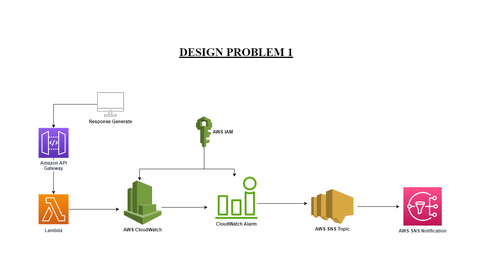

# Welcome to your CDK Python project!

## **Topics**:
+ ## [Prerequisite ](#prerequisite-of-web-health-lambda) 
+ ## [Use commands](#useful-commands).
+ ## [**(a.) Design and Develop Problem 1**](#design-and-develop-problem-1-1)
  - ### [Question of Design Problem 1](#design-and-develop-problem-1-1)
  - ### [Problem Design](#problem-design-1)
  - ### [Creating Lambda Function](#creating-lambda)
  - ### [Creating API](#creating-api-1)
  - ### [Creating Application ("APIapp.py")](#creating-application-apiapppy-1)
  - ### [Creating CloudWatch Alarm](#creating-cloudwatch-alarm-1)
  - ### [SNS Service](#set-sns-service)
+ ## [**(b.) Theoretical Question**](#theoretical-question)


## **Prerequisite :**

The `cdk.json` file tells the CDK Toolkit how I execute my app.

The initialization process creates a virtualenv within this project, stored under the `.venv`
directory.  To create the virtualenv it assumes that there is a `python3`
(or `python` for Windows) executable in my path with access to the `venv`
package. If for any reason the automatic creation of the virtualenv fails,
you can create the virtualenv manually.

To manually create a virtualenv on MacOS and Linux:

```
$ python3 -m venv .venv
```

After the init process completes and the virtualenv is created, you can use the following
step to activate your virtualenv.

```
$ source .venv/bin/activate
```

If you are a Windows platform, you would activate the virtualenv like this:

```
% .venv\Scripts\activate.bat
```

Once the virtualenv is activated, you can check the installation of NVM and NPM installation:
#### **Step:1**
```
$ curl -o- https://raw.githubusercontent.com/nvm-sh/nvm/v0.38.0/install.sh | bash
```
#### **Step:2**
After running the above commands, it's time to add a variable to your bash command. Normally, it was located from these file paths:
```
$ nano ~/.bash_profile
```
Then paste the code below, then hit crtl + o + enter then ctrl + x to close the file.
```
export NVM_DIR="$([ -z "${XDG_CONFIG_HOME-}" ] && printf %s "${HOME}/.nvm" || printf %s "${XDG_CONFIG_HOME}/nvm")"
[ -s "$NVM_DIR/nvm.sh" ] && \. "$NVM_DIR/nvm.sh" # This loads nvm
```
Then source ~/.bash_profile to set up environment for NVM:
```
$ source ~/.bash_profile
```
#### **Step:3**
To check the available lists of available node version that you can use. Type this command.
```
$ nvm ls-remote
```
NVM can install any of these versions available in the list. For example, to install version v16.3.0, type:
```
nvm install v16.3.0 && nvm use v16.3.0 && nvm alias default v16.3.0
```
Then install aws cdk module:
```
$ npm install -g aws-cdk
```
After that install all the dependencies:
```
$ pip install -r requirements.txt
```

At this point you can now synthesize the CloudFormation template for this code.

```
$ cdk synth
```

To add additional dependencies, for example other CDK libraries, just add
them to your `setup.py` file and rerun the `pip install -r requirements.txt`
command.

## Useful commands

 * `cdk ls`          list all stacks in the app
 * `cdk synth`       emits the synthesized CloudFormation template
 * `cdk deploy`      deploy this stack to your default AWS account/region
 * `cdk diff`        compare deployed stack with current state
 * `cdk docs`        open CDK documentation

# **Design and Develop problem 1 :**

## **Question of Design Problem 1:**
Consider that you are getting an event response as {“arg1”: 10} from an API.

**a.** Make an AWS app that generates an alarm if arg1 > 10.

**b.** When the alarm is raised, send an email to a dummy account.


## **Problem Design :**
The structural design of Design Problem 1 is given below:  


  
## **Creating Lambda :**

First create Lambda function in Stack file:
```
from aws_cdk import (
    Stack,
    aws_lambda as lambda_,)

from constructs import Construct

class TrainingSprint6DesignProblem1Stack(Stack):

    def __init__(self, scope: Construct, construct_id: str, **kwargs) -> None:
        super().__init__(scope, construct_id, **kwargs)

        API_Lambda = self.create_lambda("DesignAPI","./Resources","APIapp.lambda_handler",lambda_role)

        # Creating Lambda 
            def create_lambda(self, id, asset, handler, role):
                return lambda_.Function(self, 
                id = id,
                code= lambda_.Code.from_asset(asset),
                handler = handler,
                runtime=lambda_.Runtime.PYTHON_3_9,
                role = role 
                )
```
The "Resources" where handler file is situated and "APIapp" is a file name.  

since I have create lambda so I will assign a Removal policy:
```
 from aws_cdk import RemovalPolicy,

    API_Lambda.apply_removal_policy(RemovalPolicy.DESTROY)
```

Also I have IAM Role definition for CloudWatch services:
```
from aws_cdk import aws_iam as iam_
    lambda_role = self.create_lambda_role()

# creating Lambda Role:-
def create_lambda_role(self):   
    lambdaRole = iam_.Role(self, "Lambda_role",
        assumed_by=iam_.ServicePrincipal("lambda.amazonaws.com"),
        managed_policies=[
            iam_.ManagedPolicy.from_aws_managed_policy_name("AmazonAPIGatewayInvokeFullAccess"),
            iam_.ManagedPolicy.from_aws_managed_policy_name("CloudWatchFullAccess"),

        ])
    return lambdaRole
```


## **Creating API :**
Now Create a Rest API so it will generate response and send even to lambda application("APIapp.py"):

```
from aws_cdk import aws_apigateway as apigateway,

    api = apigateway.RestApi(self, "saqlain_api_design_problem",
    rest_api_name = "SaqlainAPIDesignProblem",
    endpoint_types=[apigateway.EndpointType.REGIONAL])

    all_resource = api.root.add_resource("arg1")

    api_handler = apigateway.LambdaIntegration(API_Lambda)

    all_resource.add_method("POST", api_handler)

```

## **Creating Application ("APIapp.py") :**
To create simple application, Two libraries will be use, [(1)](#https://docs.python.org/3/library/json.html) json and [(2)](#https://boto3.amazonaws.com/v1/documentation/api/latest/reference/services/cloudwatch/client/put_metric_data.html#) boto3 which is Python SDK and the AWS CLI.
```
import json
import boto3


client = boto3.client("cloudwatch")

def lambda_handler(event,context):
    body = json.loads(event["body"])
    item = {
        "arg1" : body["arg1"]
    }
    
    # Creating CloudWatch Metric
    client.put_metric_data(
            Namespace = "SaqlainDesignProblem1",
            MetricData=[
                {
                    'MetricName': "arg1_metric",
                    'Dimensions': [
                        {
                            'Name': 'arg1',
                            'Value': "arg1_for_Demo"
                        }
                    ],
                    'Value': int(body["arg1"])
                },
            ]
        )

    
    return {
        'statusCode': 200,
        'body': json.dumps(item)
            }
```

## **Creating CloudWatch Alarm :**
To create CloudWatch, first call CloudWatch metric and assign alarm to that metric:
```
from aws_cdk import aws_cloudwatch as cw,

        arg1_metric = cw.Metric(
        metric_name = "arg1_metric",
        namespace = "SaqlainDesignProblem1",
        dimensions_map= {"arg1": "arg1_for_Demo"},
        )

        arg1_alarm = cw.Alarm(self, "SaqlainDesignAlarm",
        metric= arg1_metric,
        evaluation_periods= 3,
        threshold=10,
        comparison_operator=cw.ComparisonOperator.GREATER_THAN_THRESHOLD)

```

## **Set SNS Service :**
To set AWS SNS service, first create sns topic then give add Subscription and after with CloudWatch action set an alarm: 
```
from aws_cdk import (
    aws_sns as sns,
    aws_sns_subscriptions as subscriptions,
    aws_cloudwatch_actions as cw_actions,
 )
from constructs import Construct

class TrainingSprint6DesignProblem1Stack(Stack):

    def __init__(self, scope: Construct, construct_id: str, **kwargs) -> None:
        super().__init__(scope, construct_id, **kwargs)

        #... Remaining Code from Above heading....

        topic = sns.Topic(self,"Saqlian_API_Lambda")

        topic.add_subscription(subscriptions.EmailSubscription("DUMMY-EMAIL"))

        arg1_alarm.add_alarm_action(cw_actions.SnsAction(topic))

    # create Lambda Role 
    def create_lambda_role(self):
        
        lambdaRole = iam_.Role(self, "Lambda_role",
            assumed_by=iam_.ServicePrincipal("lambda.amazonaws.com"),
            managed_policies=[
                iam_.ManagedPolicy.from_aws_managed_policy_name("AmazonAPIGatewayInvokeFullAccess"),
                iam_.ManagedPolicy.from_aws_managed_policy_name("CloudWatchFullAccess"),

            ])
        return lambdaRole    

    # Creating Lambda 
    def create_lambda(self, id, asset, handler, role):
        return lambda_.Function(self, 
        id = id,
        code= lambda_.Code.from_asset(asset),
        handler = handler,
        runtime=lambda_.Runtime.PYTHON_3_9,
        role = role 
        )
```


# **Theoretical Question :**
*What will you do if there is no lambda invocation even though the code is working fine and there is no error generated?*

* Check the AWS Lambda function configuration to ensure that the function is configured correctly, including the function name, handler function, and runtime.

* Check the CloudWatch logs for the Lambda function to see if there are any error messages or other issues.

* Ensure the Lambda function is not stuck and also ensure that the connection between the different lambda invoking services are correct.

* Check the IAM permissions for the Lambda function to ensure that it has the necessary permissions to access the required resources.

* Check the VPC configuration for the Lambda function to ensure that it has access to the necessary resources.

#### **Author:**  
Hafiz Muhammad Saqlain Mushtaque
