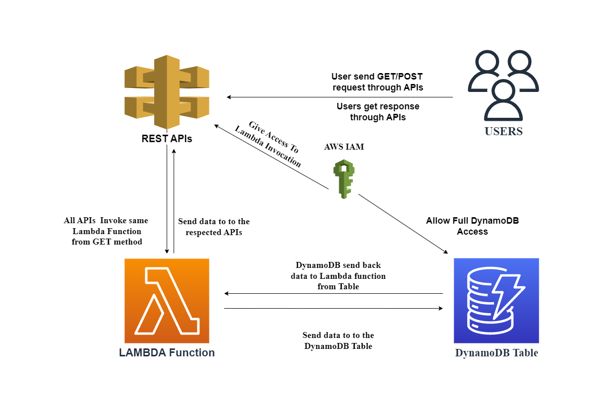

# Welcome to Design and Develop Problem 2!

## **Topics**:
+ ## [Prerequisite](#prerequisites) 
+ ## [Use commands](#useful-commands).
+ ## [**(a.) Design and Develop Problem 2**](#design-and-develop-problem-2)
  - ### [Question of Design Problem 1](#question-of-design-problem)
  - ### [Problem Design](#problem-design-1)
  - ### [Creating Lambda Function](#creating-lambda)
  - ### [Creating API](#creating-apis)
  - ### [Creating Table](#creating-dynamodb-table)
  - ### [Creating Application](#application)


## **Prerequisites :**

The `cdk.json` file tells the CDK Toolkit how I execute my app.

The initialization process creates a virtualenv within this project, stored under the `.venv`
directory.  To create the virtualenv it assumes that there is a `python3`
(or `python` for Windows) executable in my path with access to the `venv`
package. If for any reason the automatic creation of the virtualenv fails,
you can create the virtualenv manually.

To manually create a virtualenv on MacOS and Linux:

```
$ python3 -m venv .venv
```

After the init process completes and the virtualenv is created, you can use the following
step to activate your virtualenv.

```
$ source .venv/bin/activate
```

If you are a Windows platform, you would activate the virtualenv like this:

```
% .venv\Scripts\activate.bat
```

Once the virtualenv is activated, you can check the installation of NVM and NPM installation:
#### **Step:1**
```
$ curl -o- https://raw.githubusercontent.com/nvm-sh/nvm/v0.38.0/install.sh | bash
```
#### **Step:2**
After running the above commands, it's time to add a variable to your bash command. Normally, it was located from these file paths:
```
$ nano ~/.bash_profile
```
Then paste the code below, then hit crtl + o + enter then ctrl + x to close the file.
```
export NVM_DIR="$([ -z "${XDG_CONFIG_HOME-}" ] && printf %s "${HOME}/.nvm" || printf %s "${XDG_CONFIG_HOME}/nvm")"
[ -s "$NVM_DIR/nvm.sh" ] && \. "$NVM_DIR/nvm.sh" # This loads nvm
```
Then source ~/.bash_profile to set up environment for NVM:
```
$ source ~/.bash_profile
```
#### **Step:3**
To check the available lists of available node version that you can use. Type this command.
```
$ nvm ls-remote
```
NVM can install any of these versions available in the list. For example, to install version v16.3.0, type:
```
nvm install v16.3.0 && nvm use v16.3.0 && nvm alias default v16.3.0
```
Then install aws cdk module:
```
$ npm install -g aws-cdk
```
After that install all the dependencies:
```
$ pip install -r requirements.txt
```

At this point you can now synthesize the CloudFormation template for this code.

```
$ cdk synth
```

To add additional dependencies, for example other CDK libraries, just add
them to your `setup.py` file and rerun the `pip install -r requirements.txt`
command.

## Useful commands

 * `cdk ls`          list all stacks in the app
 * `cdk synth`       emits the synthesized CloudFormation template
 * `cdk deploy`      deploy this stack to your default AWS account/region
 * `cdk diff`        compare deployed stack with current state
 * `cdk docs`        open CDK documentation

# **Design and Develop problem 2 :**

## **Question of Design Problem :**
*Consider that you are getting events in the format [{“event1”:{“attr1”: value }}] from different APIs.*  
*1) How will you parse the event to get the value?*  
*2) How will you return 10 latest events when required?*


## **Problem Design :**
The structural design of Design Problem 2 is given below:  

  

  
## **Creating Lambda :**

First create Lambda function in Stack file:
```
from aws_cdk import (
    Stack,
    aws_lambda as lambda_,)

from constructs import Construct

class TrainingSprint6DesignProblem1Stack(Stack):

    def __init__(self, scope: Construct, construct_id: str, **kwargs) -> None:
        super().__init__(scope, construct_id, **kwargs)

       Event_lambda = self.create_lambda("Saqlain_Event_APIs","./Resources","Application.lambda_handler",lambda_role,)

        # Creating Lambda 
            def create_lambda(self, id, asset, handler, role):
                return lambda_.Function(self, 
                id = id,
                code= lambda_.Code.from_asset(asset),
                handler = handler,
                runtime=lambda_.Runtime.PYTHON_3_9,
                role = role 
                )
```
The "Resources" where handler file is situated and "Event_lambda.py" is a file name.  

After creating lambda function, assign a Removal policy to it:
```
 from aws_cdk import RemovalPolicy,

    API_Lambda.apply_removal_policy(RemovalPolicy.DESTROY)
```

Also I have IAM Role definition for to give full permission to  **API gateway Invoke service** and Full access to **DynamoDB**:
```
from aws_cdk import aws_iam as iam_
    lambda_role = self.create_lambda_role()

# creating Lambda Role:-
def create_lambda_role(self):   
    lambdaRole = iam_.Role(self, "Lambda_role",
        assumed_by=iam_.ServicePrincipal("lambda.amazonaws.com"),
        managed_policies=[
            iam_.ManagedPolicy.from_aws_managed_policy_name("AmazonAPIGatewayInvokeFullAccess"),
            iam_.ManagedPolicy.from_aws_managed_policy_name("AmazonDynamoDBFullAccess"),
            ])
    return lambdaRole
```


## **Creating APIs :**
Now Create minimum 2 Rest APIs so it will store and call data from DynamoDB through lambda function:

```
from aws_cdk import aws_apigateway as apigateway,

    # 1st API   
    api1 = apigateway.RestApi(self, "saqlain_event_1",
        rest_api_name = "SaqlainEvent1",
        endpoint_types=[apigateway.EndpointType.REGIONAL])

    handler = apigateway.LambdaIntegration(Event_lambda)

    api1_resource = api1.root.add_resource("event1")
    api1_resource.add_method("GET",handler)
    api1_resource.add_method("POST",handler)

    # 2nd API   
    api2 = apigateway.RestApi(self, "saqlain_event_1",
        rest_api_name = "SaqlainEvent2",
        endpoint_types=[apigateway.EndpointType.REGIONAL])

    handler = apigateway.LambdaIntegration(Event_lambda)

    api2_resource = api1.root.add_resource("event2")
    api2_resource.add_method("GET",handler)
    api2_resource.add_method("POST",handler)   

```  

## **Creating DynamoDB Table :**
 Creating a DynamoDB store all incoming values and send it  back when user request from API.
 ```
 from aws_cdk import aws_dynamodb as db
        db_table = self.creat_DynamoDBTable()
        db_table.grant_read_write_data(Event_lambda)
        Event_lambda.add_environment("Saqlain_Event_Table",db_table.table_name)

    def creat_DynamoDBTable(self):
        table = db.Table(self,"Saqlain_Event_Table",
            partition_key=db.Attribute(name="id", type=db.AttributeType.STRING),
            sort_key = db.Attribute(name="timestamp", type=db.AttributeType.STRING),
            removal_policy = RemovalPolicy.DESTROY,
        )
        return table
```

## **Application :**  
 
 ### **Libraries:**
 import boto3
 import os
 import json
 import datetime
 from decimal import Decimal
 from operator import itemgetter

 ### **Calling table:**
 dynamodb = boto3.resource('dynamodb', region_name='us-east-2')
 db_table = os.environ['Saqlain_Event_Table']
 table = dynamodb.Table(db_table)  


 ### Creating class to Solve JSON Decimal Problem
 class DecimalEncoder(json.JSONEncoder):
    def default(self, obj):
        if isinstance(obj, Decimal):
            return float(obj)
        return super(DecimalEncoder, self).default(obj)  

 ### Defining Application
 def lambda_handler(event, context):
    if event["httpMethod"] == "POST":
        # Parse the request body
        request_body = json.loads(event["body"])
        
        # Extract the value from the request body
        value = request_body[0]["event1"]["attr1"]
        time = datetime.datetime.now()
        formatted_datetime = str(time.strftime("%Y-%m-%d %H:%M:%S"))
        id = event["requestContext"]["apiId"]
        
        # Create the response body
        item = {"id": id, "value": Decimal(value), "timestamp": formatted_datetime} 

        # put item in the table
        table.put_item(Item=item)
        
        # Create the response object
        response = {
            "statusCode": 200,
            "headers": {
                "Content-Type": "application/json"
            },
            "body": json.dumps(item, cls=DecimalEncoder)
        }
        
        return response

    elif event["httpMethod"] == "GET":
        list1 = []
        list2 = []
                
        response = table.scan()
        items = response["Items"]
        items = json.loads(json.dumps(items, cls=DecimalEncoder))
        
        # table into list
        for i in range(len(items)):
            val = items[i]
            val_list = list(val.values())
            list1.append(val_list)

        
        # sorting entries w.r.t timestamps    
        sort_list = sorted(list1,key=itemgetter(2),reverse = True)

        
        # select 10 entries
        if len(sort_list)>10:
            entries = sort_list[:10]
        else:
            entries = sort_list
            
        
        # enter entries in list   
        for j in entries:
            x = {"APIid":j[1],"Time":j[2],"Value":j[0]}
            list2.append(x)
            
        
        # For Print Table
        
        # Get the keys of the dictionary to use as column headers
        headers = list(list2[0].keys())
        
        # Find the maximum length of each column
        col_widths = [max(len(str(d[h])) for d in list2) for h in headers]
        
        # Print the headers
        for i, header in enumerate(headers):
            print(f"{header:<{col_widths[i]}}", end=" ")
        print()

        # Print the data
        for d in list2:
            for i, header in enumerate(headers):
                print(f"{d[header]:<{col_widths[i]}}", end=" ")
            print()
        
        
        # Create the response object
        response = {
            "statusCode": 200,
            "headers": {
                "Content-Type": "application/json"
            },
            "body": json.dumps(list2)
        }
        
        return response
    else:
        return {
            'statusCode': 405,
            'body': json.dumps('Method not allowed')
        }

