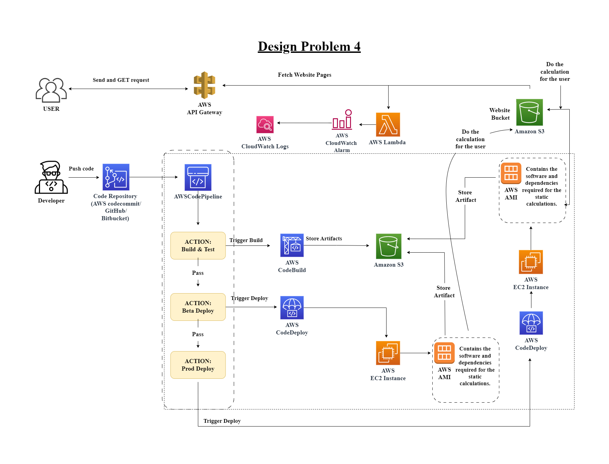

 # Welcome to Design and Develop Problem 3!

## **Question of Design Problem :**
 **1.** ***Design an end-to-end CI/CD delivery pipeline for a website on AWS that has following components:***    
 ***a) EC2 instances for some static calculations?***  
 ***b) S3 for website pages***   
 ***c) API GW and lambda triggers***  
 ***d) CloudWatch alarms on number of API calls received***

 The structural design fro the given problem is given below:  
   

  ***STEPS:***  
  **i.**  Code Design by the developer and push it to the repository.  

  **ii.** AWS code Pipeline will run and Build and test the code and store artifact in Amazon S3.  

  **iii.** When a deployment is triggered, CodeDeploy deploys the built code to the EC2 instances.   

  **iv.**  EC2 instances uses AWS AMI for the static calculation.  

  **v.** Users use api to fetch website from Website S3 bucket and S3 Bucket do the calculation from AWS AMI if needed.  
  
  **vi.** Lambda function trigger API as well as send the number of APIs to cloudwatch that will trigger alarm if user exceed.