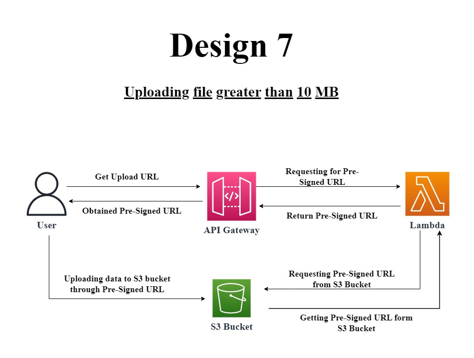

# Welcome to Design and Develop Problem 7!

## **Topics**:
+ ## [Prerequisite](#prerequisites) 
+ ## [Use commands](#useful-commands).
+ ## [**(a.) Design and Develop Problem 7**](#design-and-develop-problem-7)
  - ### [Question of Design Problem](#question-of-design-problem)
  - ### [Problem Design](#problem-design-1)
  - ### [Creating Lambda Function](#creating-lambda)
  - ### [Creating API](#creating-apis)
  - ### [Creating S3 Bucket](#creating-s3-bucket-1)
  - ### [Creating Application](#application)


## **Prerequisites :**

The `cdk.json` file tells the CDK Toolkit how I execute my app.

The initialization process creates a virtualenv within this project, stored under the `.venv`
directory.  To create the virtualenv it assumes that there is a `python3`
(or `python` for Windows) executable in my path with access to the `venv`
package. If for any reason the automatic creation of the virtualenv fails,
you can create the virtualenv manually.

To manually create a virtualenv on MacOS and Linux:

```
$ python3 -m venv .venv
```

After the init process completes and the virtualenv is created, you can use the following
step to activate your virtualenv.

```
$ source .venv/bin/activate
```

If you are a Windows platform, you would activate the virtualenv like this:

```
% .venv\Scripts\activate.bat
```

Once the virtualenv is activated, you can check the installation of NVM and NPM installation:
#### **Step:1**
```
$ curl -o- https://raw.githubusercontent.com/nvm-sh/nvm/v0.38.0/install.sh | bash
```
#### **Step:2**
After running the above commands, it's time to add a variable to your bash command. Normally, it was located from these file paths:
```
$ nano ~/.bash_profile
```
Then paste the code below, then hit crtl + o + enter then ctrl + x to close the file.
```
export NVM_DIR="$([ -z "${XDG_CONFIG_HOME-}" ] && printf %s "${HOME}/.nvm" || printf %s "${XDG_CONFIG_HOME}/nvm")"
[ -s "$NVM_DIR/nvm.sh" ] && \. "$NVM_DIR/nvm.sh" # This loads nvm
```
Then source ~/.bash_profile to set up environment for NVM:
```
$ source ~/.bash_profile
```
#### **Step:3**
To check the available lists of available node version that you can use. Type this command.
```
$ nvm ls-remote
```
NVM can install any of these versions available in the list. For example, to install version v16.3.0, type:
```
nvm install v16.3.0 && nvm use v16.3.0 && nvm alias default v16.3.0
```
Then install aws cdk module:
```
$ npm install -g aws-cdk
```
After that install all the dependencies:
```
$ pip install -r requirements.txt
```

At this point you can now synthesize the CloudFormation template for this code.

```
$ cdk synth
```

To add additional dependencies, for example other CDK libraries, just add
them to your `setup.py` file and rerun the `pip install -r requirements.txt`
command.

## Useful commands

 * `cdk ls`          list all stacks in the app
 * `cdk synth`       emits the synthesized CloudFormation template
 * `cdk deploy`      deploy this stack to your default AWS account/region
 * `cdk diff`        compare deployed stack with current state
 * `cdk docs`        open CDK documentation

# **Design and Develop problem 7 :**

## **Question of Design Problem :**
What if we have a 15MB file that we have to upload on S3 using API gateway. We have the limitation that our API gateway has the maximum payload capacity of 10MB. How will you solve this problem?

## **Problem Design :**
The structural design of Design Problem 7 is given below:  



  
## **Creating Lambda :**

First create Lambda function in Stack file:
```
from aws_cdk import (
    Stack,
    aws_lambda as lambda_,)

from constructs import Construct

class TrainingSprint6DesignProblem1Stack(Stack):

    def __init__(self, scope: Construct, construct_id: str, **kwargs) -> None:
        super().__init__(scope, construct_id, **kwargs)

       fn = self.create_lambda("Saqlain_Payload_app","./Resources","PayloadApp.lambda_handler",lambda_role)

        # Creating Lambda 
            def create_lambda(self, id, asset, handler, role):
                return lambda_.Function(self, 
                id = id,
                code= lambda_.Code.from_asset(asset),
                handler = handler,
                runtime=lambda_.Runtime.PYTHON_3_9,
                role = role 
                )
```
The "Resources" where handler file is situated and "PayloadApp.py" is a file name.  

After creating lambda function, assign a Removal policy to it:
```
 from aws_cdk import RemovalPolicy,

    fn.apply_removal_policy(RemovalPolicy.DESTROY)
```

Also I have IAM Role definition for to give full permission to  **API gateway Invoke service** and Full access to **S3 Bucket**:
```
from aws_cdk import aws_iam as iam_
    lambda_role = self.create_lambda_role()

# creating Lambda Role:-
def create_lambda_role(self):   
    lambdaRole = iam_.Role(self, "Lambda_role",
        assumed_by=iam_.ServicePrincipal("lambda.amazonaws.com"),
        managed_policies=[
            iam_.ManagedPolicy.from_aws_managed_policy_name("service-role/AWSLambdaBasicExecutionRole"),
            iam_.ManagedPolicy.from_aws_managed_policy_name("AmazonAPIGatewayInvokeFullAccess"),
            iam_.ManagedPolicy.from_aws_managed_policy_name("AmazonDynamoDBFullAccess"),
            ])
    return lambdaRole
```


## **Creating APIs :**
 Now Create Rest APIs so it will invoke lambda and get **Pre-Signed URL** fom S3 bucket :

 ```
 from aws_cdk import aws_apigateway as apigateway,

        # create REST API   
        api = apigateway.RestApi(self,'SaqlainS3API')

        # Giving API Handler
        handler = apigateway.LambdaIntegration(fn)

        # Create an API Gateway resource and method for file uploading
        resource = api.root.add_resource('upload')
        resource.add_method('GET', handler)   

 ```  
   
## **Creating S3 Bucket :**
 ```
 from aws_cdk import aws_s3 as s3,

            # Create an S3 bucket to receive the files
            bucket = s3.Bucket(self, "SaqlainPayloadBucket",
                                removal_policy=RemovalPolicy.DESTROY,
                                block_public_access=s3.BlockPublicAccess(block_public_policy=False)
                            )
            # # Environment Variable
            fn.add_environment("SaqlainPayloadBucket",bucket.bucket_name)

            # Grant the Lambda function permission to write to the S3 bucket
            bucket.grant_write(fn)
 ```

## **Creating Application :**
 ```
 import boto3
 import os
 import json

 s3 = boto3.client('s3')
 bucket = os.environ['SaqlainPayloadBucket']

 def lambda_handler(event, context):

    if event["httpMethod"] == "GET":
        # ********* Generate the pre-signed URL for the file upload *********

        file_name = event['queryStringParameters']['name']
        presigned_url = s3.generate_presigned_url(
            'put_object',
            Params={
                'Bucket': bucket,
                'Key': file_name,
            },
            ExpiresIn=3600,
        )

        return {
            'statusCode': 200,
            'body': json.dumps(presigned_url)
        }

    else:
        return {
            'statusCode': 405,
            'body': json.dumps('Method not allowed')
        }
 ```